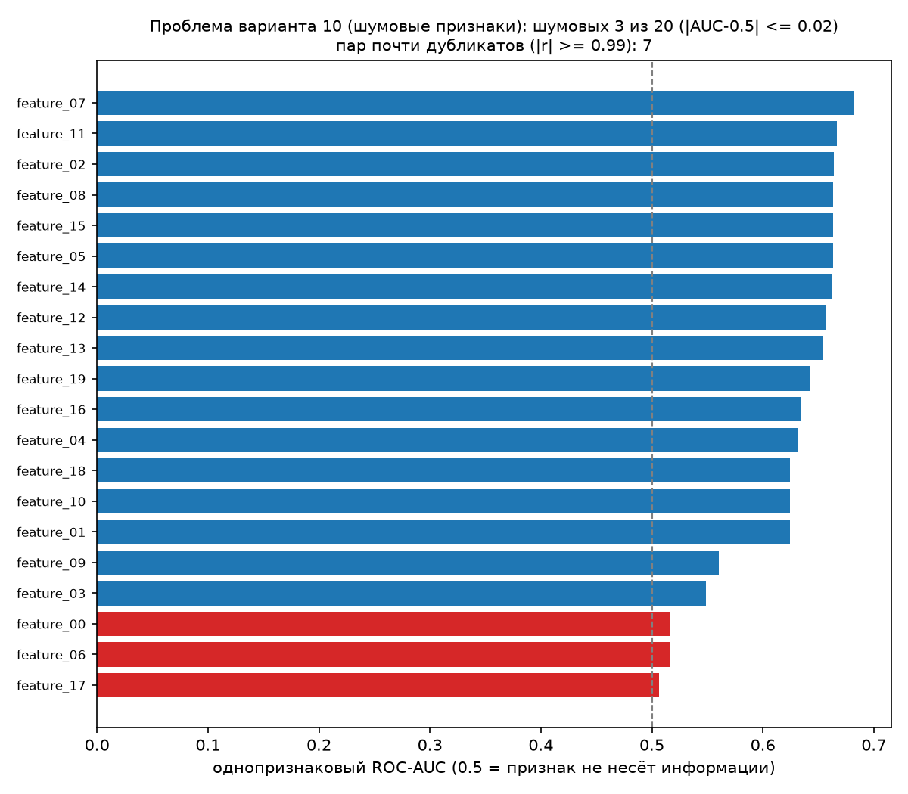
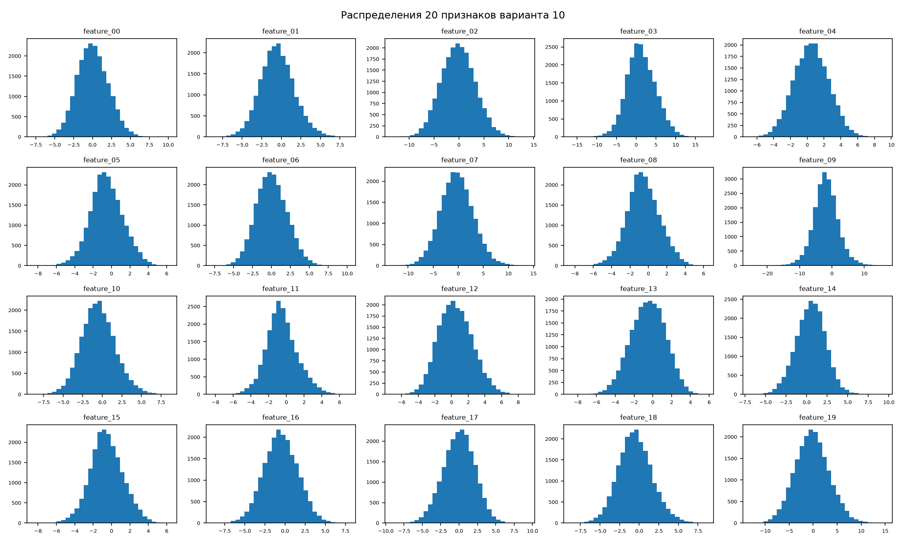
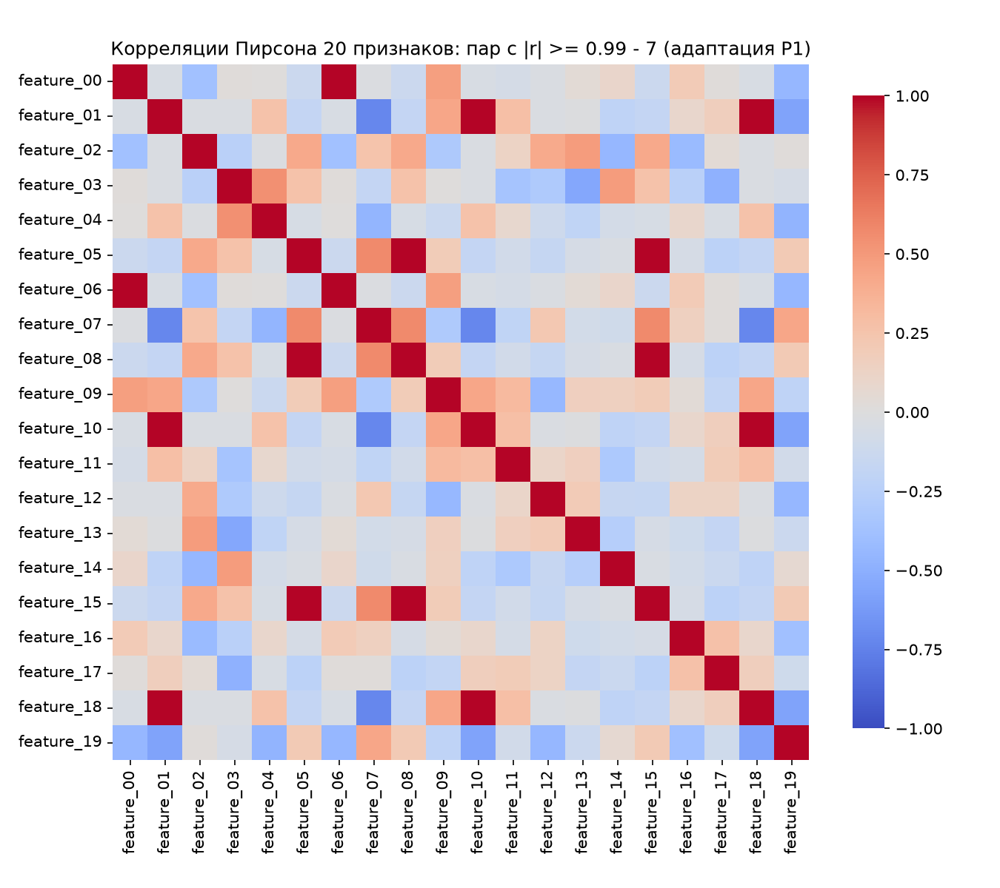

# ЛР1. Git-окружение, прекоммитные проверки и EDA варианта

| Поле | Значение |
|---|---|
| Номер варианта | 10 (Шумовые признаки, профиль P1 - табличный) |
| Номер работы | ЛР1 |
| Дата | 2026-09-24 |
| Автор | Нефедова А.А. |
| Хеш коммита кода | f4435710f63602fe1044fe7c524dff312b52d525 |
| Хеши данных | data/raw/dataset.csv sha256=6a0f0cf7c9c9b642638803e9b8db0a0fb67376d362777a756222820703ae4697 |

## 1. Паспорт данных

- Источник: scikit-learn, `sklearn.datasets.make_classification`; лицензия BSD-3-Clause.
- Способ получения: генерация в `src/eda.py --prepare`; внешний файл не загружался,
  сверка хеша - повторная генерация с тем же зерном (`--verify`, отчёт в
  reports/LAB1/hash_verify.log).
- Параметры генерации: n_samples=20000, n_features=20,
  n_informative=10, n_redundant=5,
  n_repeated=5, n_classes=2, weights=None,
  random_state=511 (configs/eda_config.yaml).
- Хеш и размер: sha256=6a0f0cf7c9c9b642638803e9b8db0a0fb67376d362777a756222820703ae4697, 7771299 байт
  (7.41 МБ) - data/hash_manifest.json.
- Объём и поля: 20000 строк, 21 столбцов - 20 числовых признаков
  feature_00...feature_19 (float64) и целевое поле target
  (int64, значения 0/1) - eda_stats.csv: n_rows, n_cols.
- План разбиения (используется с ЛР2): train 70% /
  validation 15% / test 15%,
  `train_test_split(random_state=511, stratify=target)`; препроцессинг и
  подбор гиперпараметров - только на train и validation, test применяется один раз.

## 2. Сводки EDA

Все числа - из reports/LAB1/eda_stats.csv, прогон `python src/eda.py --config
configs/eda_config.yaml`.

- Структура и типы: 20 признаков float64,
  target int64 (eda_stats.csv: dtype_features, dtype_target).
- Пропуски: 0 (eda_stats.csv: n_missing).
- Полные дубликаты строк: 0 (eda_stats.csv: n_full_duplicates).
- Аномальные значения: доля строк с |z| > 3.0 равна
  0.04385 (eda_stats.csv: outlier_row_share).
- Распределения признаков: features_grid.png; среднее и std по каждому признаку -
  eda_stats.csv (метрики mean_feature_XX, std_feature_XX).
- Доли классов (адаптация P1): класс 0 - 0.5005, класс 1 -
  0.4995 (eda_stats.csv: class_0_share, class_1_share; class_share.png).
- Связи между величинами (адаптация P1): corr_heatmap.png; максимальный |r| =
  1.0 у пары feature_00 и feature_06 (eda_stats.csv: max_abs_corr,
  max_abs_corr_pair).
- Однопризнаковая связь с целью: минимальный AUC 0.506664
  (feature_17), максимальный 0.681384
  (feature_07); шумовых признаков 3
  (eda_stats.csv: min_feature_auc, max_feature_auc, n_noise_features).

## 3. График проблемы варианта

Из 20 признаков шумовых 3 (|AUC-0.5| <= 0.02),
пар почти дубликатов (|r| >= 0.99) - 7,
минимальный однопризнаковый AUC 0.506664 у feature_17
(eda_stats.csv: n_noise_features, n_dup_pairs, min_feature_auc).

## 4. Выводы

1. Объём датасета - 20000 строк и 21 столбцов (eda_stats.csv: n_rows, n_cols; src/eda.py).
2. Все 20 признаков имеют тип float64, целевое поле target - int64 (eda_stats.csv: dtype_features).
3. Пропусков в данных 0 (eda_stats.csv: n_missing).
4. Полностью дублирующихся строк 0 (eda_stats.csv: n_full_duplicates).
5. Доля строк с аномальными значениями (|z| > 3.0) равна 0.04385 (eda_stats.csv: outlier_row_share).
6. Доля класса 1 равна 0.4995, дисбаланса классов нет (eda_stats.csv: class_1_share; class_share.png).
7. Шумовых признаков (|AUC-0.5| <= 0.02) - 3 из 20 (eda_stats.csv: n_noise_features; problem.png).
8. Минимальный однопризнаковый ROC-AUC равен 0.506664 у признака feature_17, что соответствует случайному угадыванию (eda_stats.csv: min_feature_auc; problem.png).
9. Максимальный однопризнаковый ROC-AUC равен 0.681384 у признака feature_07 (eda_stats.csv: max_feature_auc).
10. Пар признаков с |r| >= 0.99 - 7, максимальная корреляция 1.0 между feature_00 и feature_06 (eda_stats.csv: n_dup_pairs, max_abs_corr; corr_heatmap.png).
11. Заявленная проблема варианта 10 в данных видна: 3 признаков не связаны с целью и 7 пар дублируют друг друга, поэтому в ЛР2 применяется L1-регуляризация, обнуляющая такие признаки (problem.png).

## 5. Негативные контроли и проверка

| Контроль | Чем проверяли | Результат | Файл |
|---|---|---|---|
| Коммит с кодом, нарушающим стиль | hook `ruff` на файле с ошибками стиля | заблокирован | precommit_block.log, блок 1 |
| Коммит с файлом, содержащим секрет | hook `detect-private-key` на PEM-ключе | заблокирован | precommit_block.log, блок 2 |
| Коммит с бинарным файлом сверх размера | hook `check-added-large-files` на файле 2 МБ (лимит 500 КБ) | заблокирован | precommit_block.log, блок 3 |
| Прямой push в main отклонён | `git push -u origin main` при активном ruleset | отклонён сервером | push_rejected.log, screen_push_rejected.png |
| Подмена файла данных | `python src/eda.py --config configs/eda_config.yaml --tamper-check` | хеш не совпал, подмена обнаружена | hash_verify.log |
| Повторная верификация хеша | `python src/eda.py --config configs/eda_config.yaml --verify` | вердикт "совпадает" | hash_verify.log |
| Воспроизводимость выводов EDA | два прогона `python src/eda.py --config configs/eda_config.yaml` | eda_stats.csv и отчёт идентичны | eda_run1.log, eda_run2.log |

## 6. Окружение и порядок изменений

- Ветки: `main` (защищена ruleset protect-main: прямой push отклоняётся,
  изменения только через pull request), рабочая ветка ЛР1 - `dev`.
- Шаблон описания изменения: `.github/pull_request_template.md`.
- pre-commit (конфигурация - .pre-commit_config.yaml): `ruff` - стиль кода;
  `detect-private-key`, `detect-aws-credentials` - проверка секретов;
  `check-added-large-files --maxkb=500` - запрет больших файлов;
  `end-of-file-fixer`, `trailing-whitespace`, `check-yaml`, `check-json`,
  `check-merge-conflict` - быстрые проверки.
- Окружение: Python 3.14, venv `.venv`, список версий в requirements.txt.
- Прогоны MLflow: в ЛР1 не выполняются (регистрация прогонов начинается с ЛР2).

## 7. Приложения: подтверждения проверок

- reports/LAB1/push_rejected.log

push_rejected.log - текстовый вывод отклонённого прямого push в main (работает ruleset).
